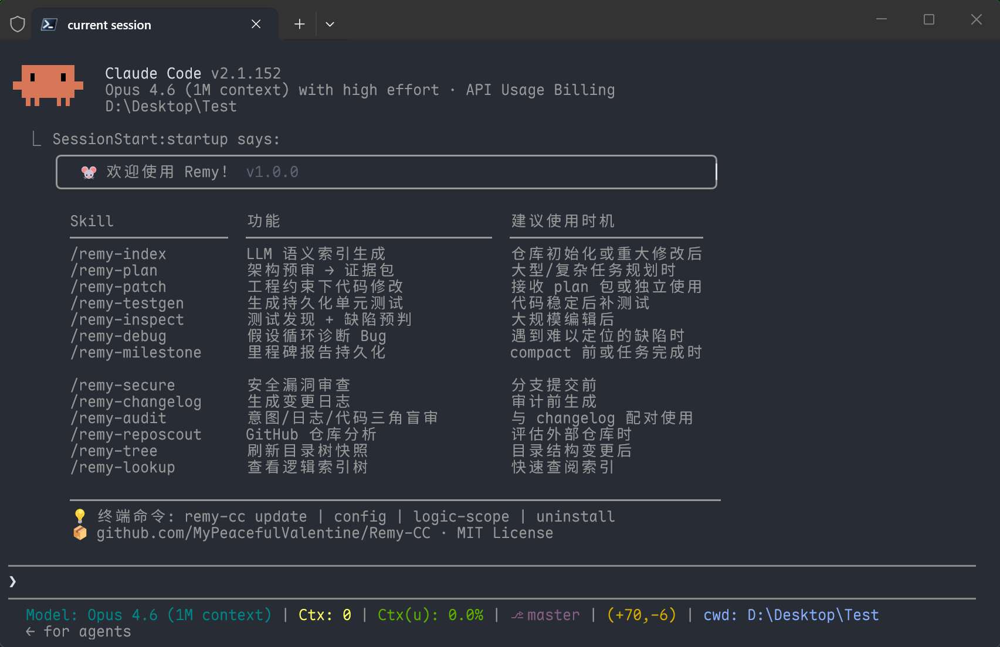

<p align="center">
  
</p>

<h1 align="center">Remy</h1>

<p align="center">
  <b>The engineering constraint layer for <a href="https://docs.anthropic.com/en/docs/claude-code">Claude Code</a> —</b><br>
  rule injection, tool interception, dependency tracking, persistent context, and structured workflows to keep long sessions under control.
</p>

<p align="center">
  <a href="LICENSE"></a>&nbsp;
  &nbsp;
  
</p>

<p align="center">
  <a href="README_zh.md">中文</a>&nbsp;|&nbsp;<b>English</b>
</p>

---

## ❓ What is Remy?

In large projects — especially when using less capable models — Claude Code can suffer from **AI hallucination** or **context rot**. Although Claude Code provides commands like `/compact` to balance task continuity with context window limits, they tend to lose structural details such as function signatures and interfaces, and cannot persistently preserve development records or project architecture.

Remy addresses these limitations by adding a layer of **automated enforcement** and **structured workflows** on top of Claude Code. It also extracts project **file structure, semantic indexes, and call relationships**, persistently **records development history**, and injects them into Claude Code's context to enable continuous context awareness and dependency tracking. **Specifically, Remy provides:**

- **Behavioral rule review** — Behavioral rules are re-injected on every user message, surviving across long conversations instead of silently decaying.
- **Dependency-aware code changes** — A semantic logic index with function-level call graph data (Python AST, C/C++/TypeScript tree-sitter) lets the system trace upstream callers and downstream dependencies before code is modified. The index extracts class inheritance (`bases` field) and synthesizes dynamic dispatch edges (interface/ABC overrides, event emitter patterns, C++ virtual functions). An adaptive output budget scales injected context density based on project size (4 tiers: full → compact → core_only → top_n).
- **Automated context maintenance** — The project file tree, semantic code index, and session history update themselves through lifecycle hooks. `CLAUDE.md` references are kept in sync by the document injector.
- **Composable verification pipeline** — Architecture review → code modification → test verification → changelog → context rewind → three-way auditing, chained through JSON task packets in `.claude/temp_task/`. Each step is independent; use what fits the task complexity.
- **Cross-session memory** — The milestone system writes structured history reports to a timeline index. New sessions load a filtered view, providing continuity without flooding the context window.
- **Environment normalization** — Shell encoding, path formatting, Conda/Mamba activation, and file naming conventions are enforced consistently on every tool call, regardless of platform.

<p align="center">
  
</p>

---

## ✨ Core Features

### Design Principles

Remy does not pursue full automation or multi-agent orchestration. Non-read-only skills require manual invocation and block at key decision points for user confirmation. The rationale: when agents pass summaries between each other, structural details like function signatures and type constraints are easily lost. Keeping the human in the development loop preserves control over change intent and scope at every stage.

### Architecture

The system is built on three coordinated layers:

- **System prompts** (`CLAUDE.md`, `style.md`, output styles) define engineering principles, communication constraints, and prohibited behaviors. They form the static behavioral baseline, loaded at session start.
- **Runtime hooks** fire automatically on Claude Code events — before every tool call, on every user message, and at session lifecycle boundaries. They re-inject behavioral rules to counteract instruction decay, normalize paths and shell environments, enrich file reads with caller/callee context from the logic index, and keep the project tree snapshot current. Hooks are the continuous enforcement layer: they run without user intervention.
- **Skills** are slash commands (`/remy-plan`, `/remy-patch`, `/remy-audit`, etc.) that you invoke manually to execute structured, multi-step development tasks. Each skill defines its own workflow with explicit inputs, outputs, and stop conditions.

These layers are coupled by design. Hooks maintain the context that skills depend on — file tree, semantic code index, and session history are all updated automatically through lifecycle events. In the other direction, skills produce artifacts (task packets, changelogs, audit reports) that hooks validate at tool-call time. For example, `/remy-plan` writes a task packet that constrains which files `/remy-patch` is allowed to edit, and `pre_tool_guard` enforces that boundary on every `Edit` call.

### Prompts (Static Rules)

| File | Content |
| :--- | :--- |
| `CLAUDE.md` | Protocol entry point. References other prompt files, declares anti-hallucination rules (recursive context integrity), lists core skills manifest, injects dynamic context (project tree, logic index, timeline) |
| `style.md` | Behavioral baseline. Defines role positioning, 5-level epistemic calibration, communication protocol (modification blocking, silent execution, agent degradation), unified tool invocation strategy |
| `tools_ref.md` | Technical execution reference. File operation procedures, Git workflow, doc sync rules, GitHub CLI constraints |
| `output-styles/system-architect.md` | Output style definition. Sets system architect role, engineering philosophy (SOLID/KISS/DRY/YAGNI), prohibited vocabulary, structured output templates (LogicChain, DecisionMatrix) |

### Hooks (Automated)

| Hook | Trigger | Function |
| :--- | :--- | :--- |
| Protocol Enforcer | Every user message | Re-injects concise rules to counteract instruction decay in long conversations |
| Pre-Tool Guard | Before each tool use | Converts absolute paths to relative; injects Conda/Mamba activation and UTF-8 encoding into shell commands; enforces snake_case file naming |
| Logic Enrichment | Before Read/Grep/Glob | Consumes dirty file entries for incremental re-parsing; appends caller/callee relationships and architecture layer for the target file (requires logic index) |
| Dirty File Tracker | After Edit/Write | Records modified file paths for incremental logic index updates on the next Read |
| Lifecycle Manager | Session start/end, pre-compaction | Regenerates the project tree snapshot and language directive; triggers full structural scan to refresh symbol line numbers and call graph; optionally launches scope selector UI for logic index injection filtering |
| Document Injector | On demand | Injects project tree, logic index (filtered by scope selection), and timeline references into `CLAUDE.md` |

### MCP Server (v1.3+)

The `remy-index` MCP server exposes 6 query tools over the Model Context Protocol, giving Claude direct access to the code intelligence graph without subprocess overhead:

| Tool | Purpose |
| :--- | :--- |
| `query_symbol` | Find symbol definitions by name — location, type, signature, layer |
| `query_summary` | Get symbol summary and docstring |
| `query_callers` | BFS upstream callers (supports `include_ambiguous` and `static_only`) |
| `query_callees` | BFS downstream callees |
| `query_impact` | Full impact analysis for modified files (equivalent to `impact.py` CLI) |
| `query_patterns` | Query event/callback registration patterns |

The server is registered in `settings.json` during installation and launched automatically by Claude Code at session start. It reads from the SQLite logic index (`logic_index.db`) in read-only mode. Configure via the "MCP Server" group in `remy-cc ui`.

### Skills (User-Invoked)

Skills with `disable-model-invocation: true` must be invoked manually. Each defines its own inputs, outputs, and stop conditions.

| Command | Purpose | Doc (Link) |
| :--- | :--- | :--- |
| `/remy-plan` | Deep analysis and planning before writing code — 5-table audit with assumption manifest, scenario probes, and verification plan | [📖](skills/remy-plan/README.md) |
| `/remy-patch` | Apply code changes with dependency tracing, discovery checkpoint, and decision logging | [📖](skills/remy-patch/README.md) |
| `/remy-inspect` | Multi-angle defect prediction + test execution + semantic quality audit (effort: low/medium/high) | [📖](skills/remy-inspect/README.md) |
| `/remy-testgen` | Generate persistent unit tests — post-hoc (default) or TDD mode with multi-angle agent analysis | [📖](skills/remy-testgen/README.md) |
| `/remy-secure` | Security-focused review of branch changes — regex pre-scan + parallel category agents + false-positive filtering | [📖](skills/remy-secure/README.md) |
| `/remy-changelog` | Generate a structured changelog recording modifications and impact | [📖](skills/remy-changelog/README.md) |
| `/remy-audit` | Verify consistency between plan, changelog, and actual code | [📖](skills/remy-audit/README.md) |
| `/remy-milestone` | Generate a history report and update the project timeline | [📖](skills/remy-milestone/README.md) |
| `/remy-index` | Parse source code to generate semantic summaries and call graph data | [📖](skills/remy-index/README.md) |
| `/remy-lookup` | Display the current logic index | [📖](skills/remy-lookup/README.md) |
| `/remy-tree` | Regenerate the project directory snapshot | [📖](skills/remy-tree/README.md) |
| `/remy-debug` | Diagnosis-only debugging with hypothesis loop, circuit breaker, and evidence packet output | [📖](skills/remy-debug/README.md) |
| `/remy-reposcout` | Inspect a GitHub repository in a sandboxed temporary directory | [📖](skills/remy-reposcout/README.md) |
| `/remy-insight` | Deep multi-agent repository analysis — global, focus, and compare modes with configurable depth | [📖](skills/remy-insight/README.md) |
| `/remy-ci` | Analyze CI/CD failure logs — compile, link, test, sanitizer, QEMU, style, static analysis, build config | [📖](skills/remy-ci/README.md) |

### Development Cycle

A full development cycle follows this sequence. Not every step is required for every change — scale to the task complexity.

0. **`/remy-index`** (**initialization**): Generate the semantic code index for your project (requires LLM API configured during installation). After the first full scan, subsequent invocations update incrementally. ([doc](skills/remy-index/README.md))
1. **`/remy-plan`** — Review architecture risks. Resolve ambiguities. 5-table audit with verification plan. Outputs a task packet. ([doc](skills/remy-plan/README.md))
2. **`/remy-patch [packet]`** — Apply changes with dependency tracing. Optionally constrained by the task packet. ([doc](skills/remy-patch/README.md))
3. **`/remy-testgen`** — Generate unit tests. Post-hoc mode (default) or TDD mode (generates red test skeletons from plan packets or stubs). Supports effort levels and configurable coverage thresholds. ([doc](skills/remy-testgen/README.md))
4. **`/remy-inspect`** — Multi-angle defect prediction, test execution, branch coverage, semantic quality audit. Supports effort levels. ([doc](skills/remy-inspect/README.md))
5. **`/remy-changelog`** — Generate a structured changelog recording what changed and why. ([doc](skills/remy-changelog/README.md))
6. **`/rewind`** — (Claude Code built-in) Restore conversation context to the pre-modification checkpoint, removing implementation bias.
7. **`/remy-audit [log] [packet]`** — Verify consistency between plan, changelog, and code. ([doc](skills/remy-audit/README.md))
8. **`bash (git commit)`** — Commit the verified changes.
9. **`/remy-milestone`** — Record a history report and update the project timeline. ([doc](skills/remy-milestone/README.md))
10. **`/remy-tree`** (optional) — Refresh the project tree snapshot if file structure changed. Hooks normally handle this automatically. ([doc](skills/remy-tree/README.md))

For small, low-risk changes, steps 3–6 can be skipped.

> [!NOTE]
> **Plan → Modify → Audit and Three-Way Verification**
>
> Three skills can be chained via JSON task packets in `.claude/temp_task/`:
>```
>/remy-plan                          → writes task packet
>  └→ /remy-patch <packet>           → uses packet as change boundary
>        └→ /remy-audit <log> <packet>  → three-way verification (plan vs. log vs. code)
>```
> Each step is independent. Skipping `/remy-plan` removes the boundary constraints on `/remy-patch` and reduces `/remy-audit` to a two-way check (log vs. code only).

> [!NOTE]
> **TDD (Red-Green-Refactor) vs. Post-hoc Testing**
>
> `/remy-testgen` supports two workflows depending on when tests are written relative to implementation:
>```
> TDD workflow (--tdd):
>   /remy-plan → /remy-testgen --tdd <packet> → /remy-patch <packet> → /remy-inspect
>   (plan → RED tests → GREEN implementation → verify)
>
> Post-hoc workflow (default):
>   /remy-plan → /remy-patch <packet> → /remy-testgen → /remy-inspect
>   (plan → implement → generate tests → verify)
>```
> TDD mode generates failing test skeletons from interface specifications (plan packets or stub functions) and outputs a packet for `/remy-patch`. Post-hoc mode reads existing implementation and generates tests that validate current behavior. Both support effort levels (low/medium/high) and configurable coverage thresholds.

> [!NOTE]
> **Repository Analysis Workflow**
>
> To analyze an external repository with `/remy-insight`:
>```
> 1. Clone the repository (manually, or use /remy-reposcout to assess first)
> 2. cd into the repository and launch Claude Code
> 3. /init                → generate CLAUDE.md
> 4. /remy-index          → generate logic_index.db (requires LLM API)
> 5. /clear               → refresh injected context
> 6. /remy-insight [mode] → run analysis (global | focus <topic> | compare <doc>)
>```
> `/remy-reposcout` performs a shallow metadata assessment before cloning. `/remy-insight` performs deep semantic analysis after indexing.

---

## 🚀 Quick Start

### Requirements

| Requirement | Purpose |
| :--- | :--- |
| Claude Code CLI ≥ 2.1.139 | Event hooks and skill invocation |
| Python 3.10+ | Hook scripts, installer, MCP server |
| OpenAI-compatible LLM API | Semantic summarization for `/remy-index` |
| Conda or Mamba (optional) | Auto-injected into shell environment when present |
| `gh` CLI (optional) | Required by `/remy-reposcout` and `/remy-ci` GitHub Actions mode |
| tree-sitter Python packages (optional) | Higher-precision C/C++/TypeScript parsing and call graph extraction |
| `mcp` Python package (optional) | Required for the remy-index MCP server (`pip install mcp`) |

Language is configurable via the `REMY_LANG` environment variable (`en` or `zh-CN`).

### Installation

Remy supports one-line install scripts:

```bash
# macOS / Linux
curl -fsSL https://raw.githubusercontent.com/MyPeacefulValentine/Remy-CC/main/install.sh | sh

# Windows (PowerShell)
irm https://raw.githubusercontent.com/MyPeacefulValentine/Remy-CC/main/install.ps1 | iex
```

Or install from source:

```bash
git clone https://github.com/MyPeacefulValentine/Remy-CC.git
cd Remy-CC
python install.py                # English (default)
python install.py --lang zh-CN   # Simplified Chinese
```

The installer:
- Copies hooks, skills, output styles, and config files to `~/.claude/`
- Merges hook registrations, MCP server entries, and environment variables into `~/.claude/settings.json` (existing values are preserved)
- Expands hook and MCP server paths to absolute paths for the current machine
- Prompts for LLM API configuration (URL, model, API key) used by `/remy-index`
- Optionally installs `mcp` SDK for the remy-index MCP server
- Creates the `remy-cc` CLI command and optionally adds it to system PATH

### CLI & Configuration

After installation, the `remy-cc` command is available system-wide:

| Command | Description |
| :--- | :--- |
| `remy-cc ui` | Open browser-based settings editor for `~/.claude/settings.json` |
| `remy-cc project <path>` | Open project-level settings editor for `<path>/.claude/settings.local.json` |
| `remy-cc logic-scope [--path <dir>]` | Configure which logic index files are injected at session start |
| `remy-cc update` | Fetch and install the latest version |
| `remy-cc uninstall` | Remove all Remy files and settings |
| `remy-cc verify` | Check installation integrity |
| `remy-cc version` | Print installed version |

The settings editor provides a bilingual interface (English / 中文) for managing environment variables across 12 groups (Logic Index, Impact Analysis, Context Injection, Timeline, Post-Verify, Security Audit, Debug, Test Generation, CI/CD, Insight, MCP Server, System, Claude Code). Project-level settings inherit from global by default; individual parameters can be overridden.

---

## 🔗 Friends

Thanks for the support and feedback from the community at **[LINUX DO](https://linux.do/)**.
